# Multi-Cloud Auto Deployment (AWS + GCP) using Terraform

This project provisions NGINX web servers on AWS and GCP using Terraform and implements a local DNS-based failover system using DNSMasq and a Python watchdog script running in Docker.


## Features
- Deploys identical NGINX servers on AWS EC2 and GCP Compute Engine  
- Health monitoring using Python watchdog  
- Local DNS failover using DNSMasq  
- Automatic traffic switch from AWS → GCP when AWS becomes unavailable  

## Prerequisites
- Terraform  
- AWS & GCP accounts  
- Docker + Docker Compose  
- GCP service account

## How to Run
### 1. Deploy Infra
```bash
cd terraform
terraform init
terraform apply
```
### 2. Start Failover System
```bash
cd ../failover
docker compose up -d
```
### 3. Test Failover

```bash
dig @127.0.0.1 -p 53535 app.multi.local
```
Stop AWS instance → traffic switches to GCP automatically!

## Screenshots

**AWS Instance Dashboard**  
  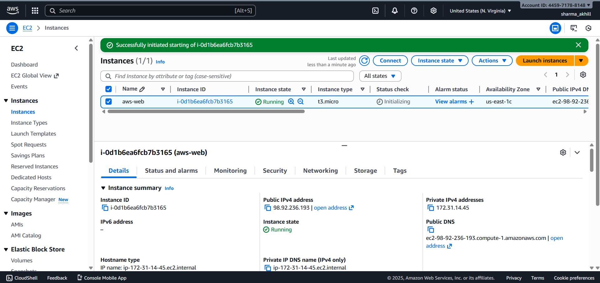

**GCP Instance Dashboard**  
 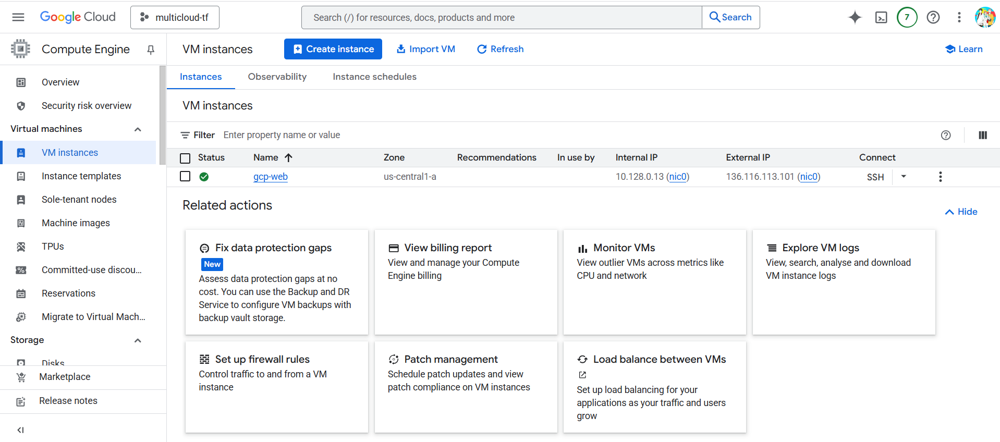

**AWS NGINX Output**  
 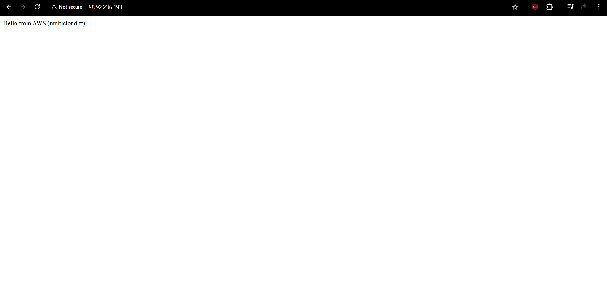

**GCP NGINX Output**  
 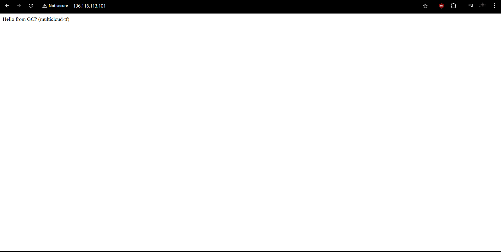

**Docker Compose**  
 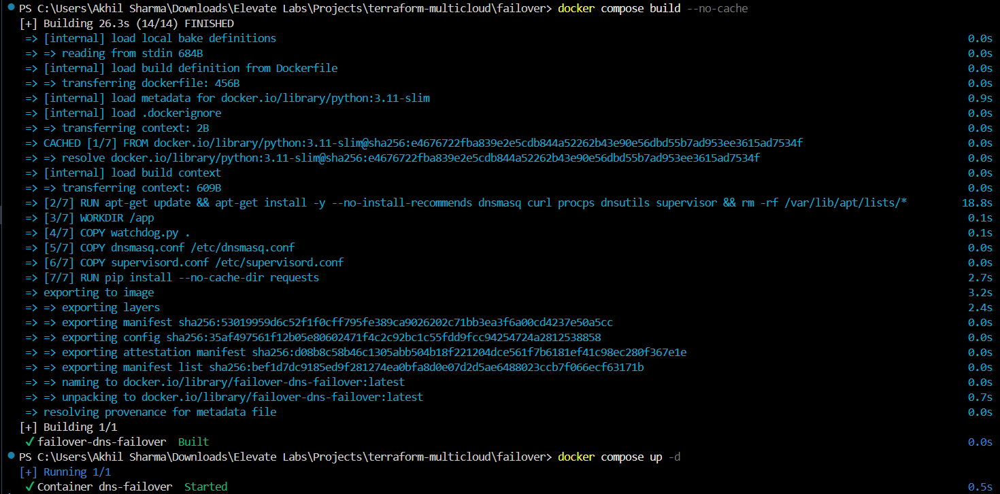

**DNSMasq Configuration**  
 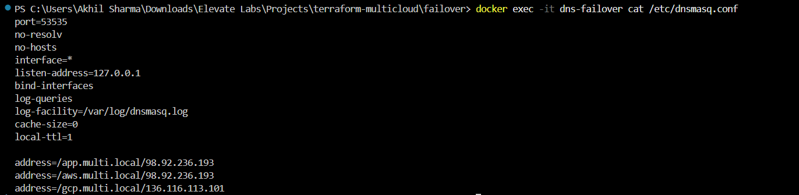

**dig Command (AWS Active)**  
 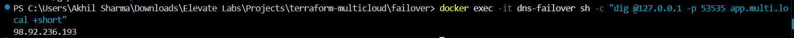

**curl Response (AWS)**  
 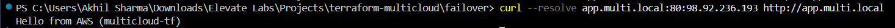

**AWS Instance Stopped**  
 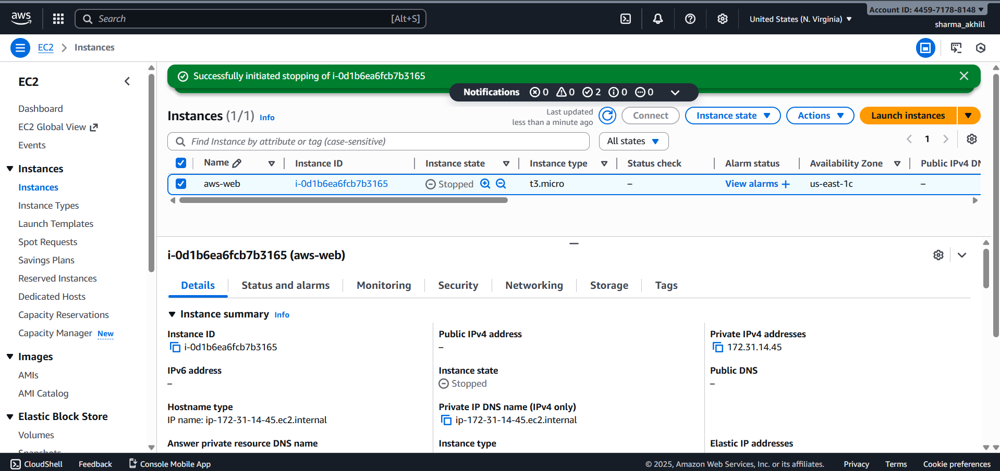

**dig Command (After failover)**  
 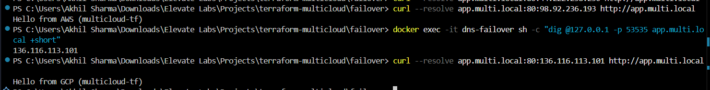

**Watchdog Log - Switchover Event**  
 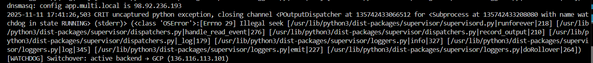